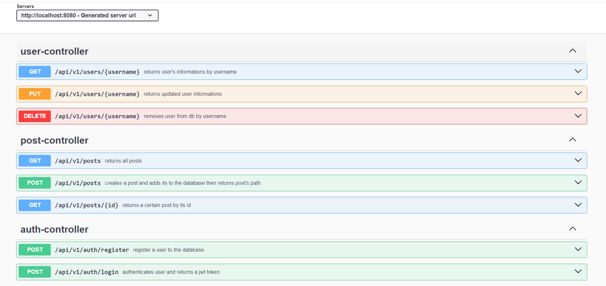

# Blog Backend

## About the Project  
This backend project is developed to provide functionality for a blog site. Users can log in to the system using a username and password, performing authentication via JWT (JSON Web Token). The JWT token is included in every request to ensure secure communication with the backend.  

The project includes the classic features of a blog site:  
- Users can create their own blogs,  
- View blogs created by others,  
- Comment on blogs,  
- Update their profile information.

---

## Technologies and Tools Used  
This backend project is developed using the following technologies and tools:  
- **Programlama Dili:** Java  
- **Framework:** Spring Boot  
- **Kimlik Doğrulama:** Spring Security  
- **Veritabanı Erişimi:** JPA/Hibernate  
- **API Dökümantasyonu:** Swagger  
- **Proje Yönetimi ve Build Aracı:** Maven  

---

## Installation and Run Instructions  
To run this project locally, follow the steps below:  

### 1. Clone the Project  
```bash
git clone <repository-url>
cd <repository-folder>
```

### 2. Install Dependencies  
Install dependencies using Maven:  
```bash
mvn clean install
```

### 3. Configure the Database  
Edit the `application.properties` file to set up the database connection:  
```properties
spring.datasource.url=jdbc:postgresql://localhost:5432/blog
spring.datasource.username=postgres
spring.datasource.password=12345
```

### 4. Start the Application  
Start the application with the following command:  
```bash
mvn spring-boot:run
```

---

## API Documentation  
All API endpoints of the project can be accessed via the Swagger interface.  

Swagger Interface:  
[http://localhost:8080/swagger-ui/index.html](http://localhost:8080/swagger-ui/index.html)  

Swagger screenshot:  
  

---

## Database Details  
The project uses a PostgreSQL database. The default settings are as follows:  

- **Veritabanı Türü:** PostgreSQL  
- **Host:** `localhost`  
- **Port:** `5432`  
- **Veritabanı Adı:** `postgres`  
- **Kullanıcı Adı:** `postgres`  
- **parola:** `12345`  

Key tables used in the project:  
1. **Users:**  
   Stores user information (username, password, email, etc.).  
2. **Blogs:**  
   Stores blog titles, content, and author information.  
3. **Comments:**  
  Stores comments on blogs and the corresponding user information.

